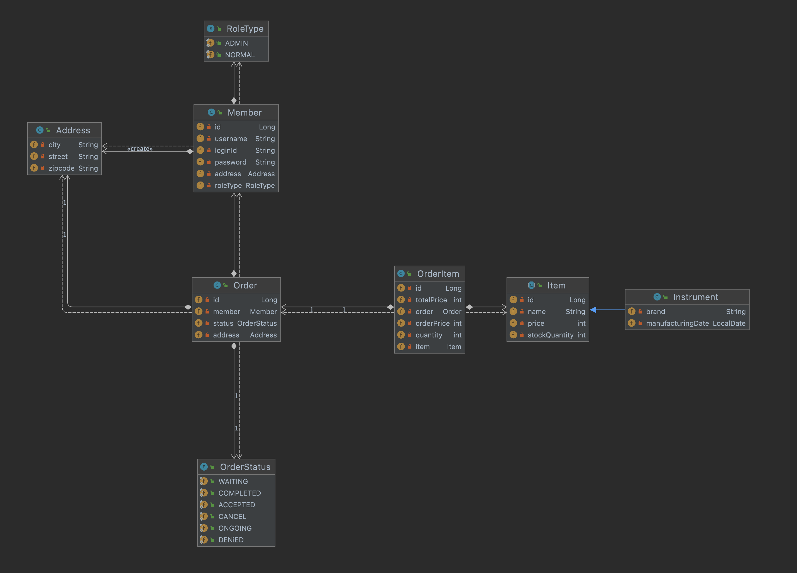
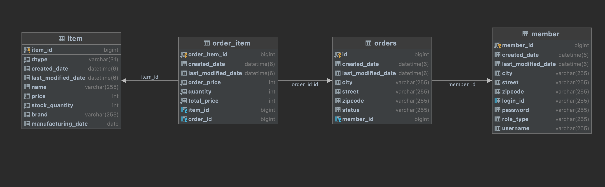

# Toy Project 주문 시스템 (Order By Spring) 2021. 09. 15 ~ 10.17)

## 개요 및 목표

- 그동안 공부했던 기술들을 Test 한다.
- 주문 시스템을 구현하는 것을 목표로 한다. ( 상품의 경우 배송이 가능한 상품으로 제작 )
- Spring에서 Entity가 아닌 Dto 로 반환하여 필요한 엔티티 구조가 넘어가지 않게 한다.
- login은 session을 통하여 구현

---

## 사용 기술 스택

- Backend
  - java 8, Spring Data Jpa, Jpa, QueryDsl, Spring MVC
  
    

- Frontend

  - Html/ Css / javascript / Thymeleaf

  

- Database
  - Mysql8.0
  
    

- Tools
  - Inteillj

- Others

  - AWS - EC2 / RDS

---

## 전체 Entity Graph

---

## DB Table

## 구현된 기능

- Member Service
  - 회원 가입, 회원 정보 수정의 기능이 가능하다. 내부적인 시스템으로 CRUD가 전부 가능하다.
  - admin 계정을 통하여 주문 관리 기능
- Order Service
  - 기본적인 CRUD 기능과 pk, 이름 검색을 지원한다.
  - member Id를 통한 Order List 조회 및 view
  - 주문 생성 기능
- Order Item Service
  - 기본적인 CRUD기능 및 order Id를 통한 조회
  - 주문 취소시 Item의 수량 변경
  -  order자체가 삭제 될 경우 처리
- Login Service
  - Spring session 및 을 통하여 구현
- Item Service
  - 아이템에 관련한 CRUD 기능
  - 아이템 조회 및 아이템 탐색

---

## Order By Spring의 History

- 주문 서비스 및 멤버 서비스 구현 및 테스트 케이스 작성(09/15)

  - 멤버 서비스의 기능

    - 기본적인 CRUD 기능
    - 조회는 전체와 pk와 이름을 통한 단일 조회가 가능하다.

  - 주문 서비스의 기능

    - 기본적인 CRUD 기능

    - 조회 기능은 pk, member를 이용하여 가능하며 전체 조회가 가능하다.

      

- 주문 아이템 서비스, 아이템 서비스 및 테스트 케이스 작성(09/17)

  - 아이템 서비스의 기능
    - 기본적인 CRUD 기능
    - 조회는 pk로 인한 조회, 이름이 정확히 일치할 경우 조회, 전체 조회, 이름에 포함될 경우 조회를 지원한다.
  - 주문 아이템 서비스의 기능
    - 기본적인 CRUD 기능
    
    - pk로 인한 조회, Order를 통한 조회
    
    - 주문 취소시 Item의 수량 업데이트
    
    - 삭제의 경우 2가지를 지원 Order에 포함된 모든 orderItem 삭제 후 Item 수량 업데이트 및 단일삭제 후 Item 수량 업데이트
    
    - 저장시 Item 수량 업데이트
    
      

- login 반환 객체 dto 변경(10/05)

  

- 로그인 컨트롤러 구현(10/07)

  

- user page view 구현, user page내 로그인 관련 기능 구현 (10/8)

  - 로그인 관련 기능
    - 로그인
    
    - 회원 가입
    
    - 회원 정보 수정
    
    - 로그 아웃
    
      
  
- Order List View & 주문 수정 기능 구현 (10/10)

  

- 주문 및 아이템 View 구현(10/11)

  - 아이템 등록
  - 아이템 수정
  - 아이템 리스트 / 리스트 탐색
  - 주문
  - UI 개선

  

- AWS 배포(10/13)

  - EC2 / RDS 를 통한 배포

  

- Admin Page 구현(10/16)

  - 주문 상태 변경 가능(admin 만 가능
  - member객체에 RoleType 추가

  

  

